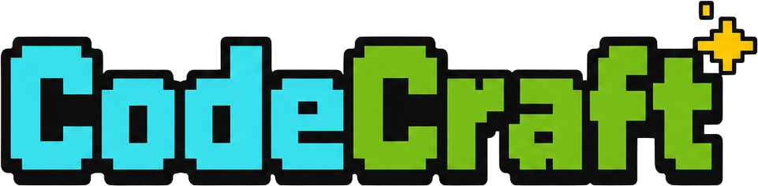

<p align="center">
  
</p>

> A blocky, voxel-builder-inspired web game that teaches kids (ages 9–12) to write **HTML, CSS, and JavaScript** — with a live code editor, instant visual feedback, XP, ranks, and collectible badges. Fully bilingual **English / Tiếng Việt**.

### 🎮 Play it now → **[mycodecraft.app](https://www.mycodecraft.app)**

CodeCraft turns "learn to code" into an adventure. Kids mine their way through three themed worlds, completing short coding quests in a real editor and watching their code come to life in a live preview — earning XP and climbing from **Dirt** to **Obsidian** along the way.

It's **local-first and kid-safe**: no accounts, no logins, no network calls, no tracking. Everything runs in the browser and progress is saved on the device. Built originally for the developer's own kids, now open-sourced for any family or classroom.

---

## ✨ Features

- **🗺️ Three themed worlds, ~30 quests** — 🟫 *HTML Grasslands* → 🟦 *CSS Caves* → 🟨 *JS Sparkstone Mines*, unlocking in sequence as kids progress.
- **⌨️ Real code, real editor** — a kid-friendly [CodeMirror 6](https://codemirror.net/) editor with a sandboxed live preview that re-renders as they type.
- **✅ Teaching-first validation** — each quest checks the kid's code and responds with friendly, encouraging hints ("Hmm, I don't see an `<h1>` yet — signs need a big title!") instead of cryptic errors.
- **🏆 Gamified progression** — XP, six ranks (Dirt → Stone → Iron → Gold → Diamond → Obsidian), world-themed collectible badges, daily streaks, and sound effects.
- **🌏 Fully bilingual** — every lesson, hint, and UI string is written in both English and Tiếng Việt, toggleable at runtime.
- **👨‍👩‍👧‍👦 Multiple kid profiles** — pick-your-player profiles on one device, no passwords.
- **🔒 Private by design** — 100% local, progress in `localStorage`, no backend, no analytics, no accounts.

---

## 🚀 Quick start

```bash
git clone https://github.com/damtt/mycodecraft.git
cd mycodecraft
npm install
npm run dev      # http://localhost:5173
```

Open the URL in any modern browser, create a profile, and start mining.

To build a static production bundle (deployable to any static host — GitHub Pages, Netlify, Vercel, or a folder on a tablet):

```bash
npm run build    # typecheck + production build → dist/
npm run preview  # serve the production build locally
```

---

## 🎮 How it works

1. **Pick a player** — create a profile with a name and pixel-art avatar.
2. **Choose a quest** on the world map. Worlds and quests unlock linearly; finished quests stay open for free-play practice.
3. **Read the lesson** on the left, write code in the editor (top-right), and watch the live preview (bottom-right).
4. **Click "Check my code"** — pass all checks to trigger a victory overlay with XP, a badge drop, and a chime.
5. **Level up.** Keep a daily streak alive, collect every badge, and aim for the Obsidian rank.

---

## 🧩 For parents & teachers

- **Everything is local.** No accounts, no sign-up, no network calls. Progress lives in the browser's `localStorage`, and multiple kids can each have their own profile on the same device.
- **No punishment mechanics.** Hearts in the HUD are decorative — there are no lives, no penalties, and checks can be retried forever. Hints are always free.
- **Reset progress** anytime: *Settings → hold the red button* (a deliberate hold-to-confirm guard so it can't be triggered by accident).
- **Sound** can be muted globally in Settings.

---

## 🛠️ Tech stack

| | |
|---|---|
| **Framework** | [React 19](https://react.dev/) + [TypeScript](https://www.typescriptlang.org/) (strict) |
| **Build** | [Vite 6](https://vite.dev/) |
| **Routing** | [React Router 7](https://reactrouter.com/) |
| **State** | [Zustand](https://github.com/pmndrs/zustand) (persisted to `localStorage`, versioned schema) |
| **Styling** | [Tailwind CSS 4](https://tailwindcss.com/) — custom blocky theme |
| **Editor** | [CodeMirror 6](https://codemirror.net/) |
| **Testing** | [Vitest](https://vitest.dev/) + [React Testing Library](https://testing-library.com/) |

The validation engine is fully **declarative** — quests describe pass conditions as data (`elementExists`, `textIncludes`, `computedStyle`, `consoleIncludes`, …), and the engine renders the kid's code in a sandboxed iframe to check against the real DOM. JavaScript runs inside the same sandbox with `console.log` bridged out via `postMessage`. **No `eval` of matcher code.**

---

## 📂 Project structure

```
src/
├── app/                  # Router, layout shell, providers
├── screens/              # title / players / map / quest / inventory / settings
├── components/           # shared UI: PixelButton, HudBar, XpBar, VictoryOverlay…
├── features/
│   ├── editor/           # CodeMirror wrapper, kid-friendly config
│   ├── preview/          # sandboxed iframe preview (srcdoc)
│   ├── validation/       # declarative check engine
│   ├── progress/         # XP / levels / streaks / badges (pure functions)
│   └── audio/            # sound manager (preloaded effects, mute toggle)
├── content/
│   ├── worlds.ts         # world metadata (3 worlds)
│   ├── quests/           # html/qNN.ts · css/qNN.ts · js/qNN.ts
│   └── i18n/             # UI string dictionaries { en, vi }
├── stores/               # Zustand: profileStore, settingsStore
└── lib/                  # localStorage helpers, shared types
```

---

## ✍️ Adding or editing quests

Quest content lives in `src/content/quests/<world>/qNN.ts` — **one typed TypeScript file per quest**, no CMS and no fetching. Each quest defines its story, numbered steps (with optional hints), starter code, XP, an optional badge, and declarative checks — all bilingual:

```ts
export const q01: Quest = {
  id: 'html-01',
  world: 'html',
  xp: 50,
  badge: 'b-wood',
  title: { en: 'Hello, World!', vi: 'Xin chào, Thế giới!' },
  story: {
    en: 'A villager wants to greet travelers, but the welcome sign is blank!',
    vi: 'Một dân làng muốn chào du khách, nhưng tấm biển chào mừng đang trống trơn!',
  },
  steps: [ /* … */ ],
  starterCode: '<!-- ⛏️ Type your code below this line! -->\n',
  checks: [
    {
      type: 'elementExists',
      selector: 'p',
      failMessage: {
        en: "Hmm, I don't see a `<p>` tag yet. Paragraphs start with `<p>` and end with `</p>`!",
        vi: 'Hmm, mình chưa thấy tag `<p>` nào. Đoạn văn bắt đầu bằng `<p>` và kết thúc bằng `</p>` nhé!',
      },
    },
  ],
};
```

`src/content/quests/content.test.ts` enforces structure and **bilingual completeness** — every player-facing string must exist in both `en` and `vi`, so new content can't ship half-translated.

---

## 🧪 Development

```bash
npm test          # vitest watch mode
npm run test:run  # CI mode (run once)
npm run typecheck # tsc --noEmit
npm run build     # typecheck + production build
```

---

## 🤝 Contributing

Contributions are welcome — especially **new quests**, **translation fixes**, and **bug reports**. The easiest way to help:

- **Add a quest** — copy an existing `qNN.ts`, write it in both languages, and run `npm run test:run` to confirm it passes the content checks.
- **Improve translations** — the Vietnamese strings live alongside the English in every content and i18n file.
- **Report a bug** or suggest an idea via [GitHub Issues](https://github.com/damtt/mycodecraft/issues).

Please run `npm run build` before opening a pull request to confirm types and tests pass.

---

## 📄 License

[MIT](./LICENSE) — free to use, modify, and share. Built with ❤️ for curious kids.
